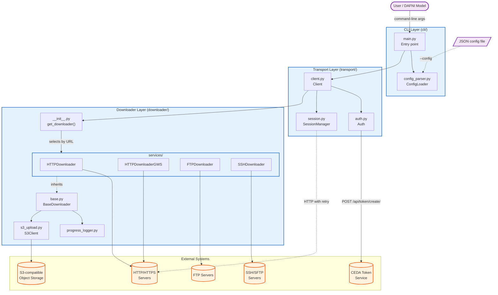
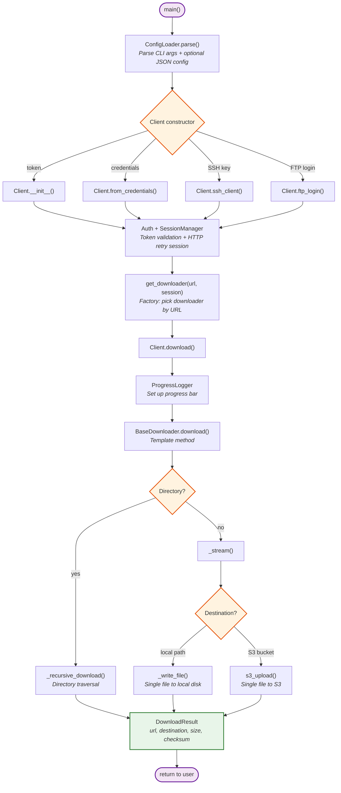

# Architecture

This document gives a high-level view of how the Dataset Download Tool is
organised and how its layers interact. For the detailed class model, design
patterns, and runtime sequence diagrams, see [Design](design.md).

## Layers

The codebase is organized into three layers:

| Layer          | Package       | Responsibility                                                   |
| -------------- | ------------- | ---------------------------------------------------------------- |
| **CLI**        | `cli/`        | Argument parsing, config file loading, entry point orchestration |
| **Transport**  | `transport/`  | Authentication, HTTP session management, client construction     |
| **Downloader** | `downloader/` | Protocol-specific file downloads, S3 upload, progress tracking   |

## Software Architecture Diagram

The diagram below shows the major components of the tool, how they are grouped
into layers, and how they interact with external systems (the user, remote
dataset servers, the CEDA token service, and S3-compatible object storage).

The `main()` entry point in the CLI layer delegates argument handling to
`ConfigLoader`, then constructs a `Client` in the transport layer. The
`Client` sets up authentication and an HTTP session (with retry logic) and
uses the `get_downloader()` factory to pick a concrete downloader from the
downloader layer based on the URL protocol. Each concrete downloader talks
to its own external protocol endpoint, and destination writes can go either
to the local filesystem or — via `S3Client` — to an S3-compatible bucket.

## Data Flow Summary

The diagram below traces the main function calls made during a single
invocation of the tool, from `main()` through to the final `DownloadResult`.
Each node is labelled with the function or class responsible for that step.

For the detailed class model and runtime sequence diagrams, see
[Design](design.md).
