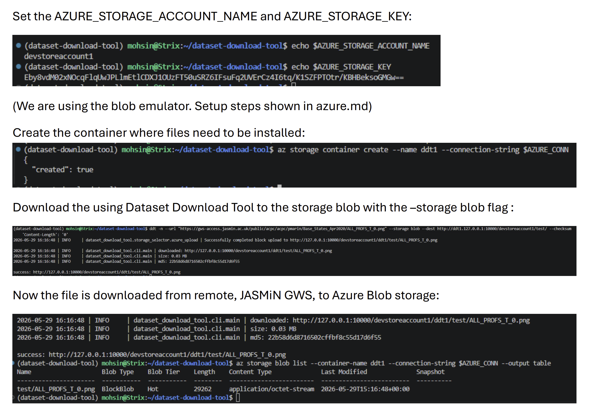

# Azurite Azure Blob Storage Emulator — Setup Guide

## Prerequisites

### 1. Azure CLI
Used to interact with Azurite from the command line:

```bash
curl -sL https://aka.ms/InstallAzureCLIDeb | sudo bash
```

Verify:
```bash
az --version
```

---

### 2. Python Dependencies
Install the Azure Blob Storage SDK:

```bash
pip install azure-storage-blob
```

---

## Starting Azurite

### Pull the latest image:
```bash
docker pull mcr.microsoft.com/azure-storage/azurite:latest
```

### Run the container:
```bash
docker run -d \
  -p 10000:10000 \
  --name azurite \
  mcr.microsoft.com/azure-storage/azurite:latest \
  azurite --skipApiVersionCheck --blobHost 0.0.0.0
```

| Port  | Service       |
|-------|---------------|
| 10000 | Blob storage  |
| 10001 | Queue storage |
| 10002 | Table storage |

> `--skipApiVersionCheck` prevents version mismatch errors between the Azure SDK and Azurite.

### Stop / Start:
```bash
docker stop azurite
docker start azurite
```

---

## Default Credentials

Azurite uses fixed built-in credentials, these are not real Azure credentials:

| Field        | Value                                                                 |
|--------------|-----------------------------------------------------------------------|
| Account Name | `devstoreaccount1`                                                    |
| Account Key  | `Eby8vdM02xNOcqFlqUwJPLlmEtlCDXJ1OUzFT50uSRZ6IFsuFq2UVErCz4I6tq/K1SZFPTOtr/KBHBeksoGMGw==` |
| Blob URL     | `http://127.0.0.1:10000/devstoreaccount1`                            |

### Connection string:
```
DefaultEndpointsProtocol=http;AccountName=devstoreaccount1;AccountKey=Eby8vdM02xNOcqFlqUwJPLlmEtlCDXJ1OUzFT50uSRZ6IFsuFq2UVErCz4I6tq/K1SZFPTOtr/KBHBeksoGMGw==;BlobEndpoint=http://127.0.0.1:10000/devstoreaccount1;
```

---

## Environment Variables

Set these before running the tool:

```bash
export AZURE_STORAGE_ACCOUNT_NAME=devstoreaccount1
export AZURE_STORAGE_KEY=Eby8vdM02xNOcqFlqUwJPLlmEtlCDXJ1OUzFT50uSRZ6IFsuFq2UVErCz4I6tq/K1SZFPTOtr/KBHBeksoGMGw==
```

---

## Creating a Container

Before uploading, you must create a container (equivalent to an S3 bucket):

```bash
export AZURE_CONN="DefaultEndpointsProtocol=http;AccountName=devstoreaccount1;AccountKey=Eby8vdM02xNOcqFlqUwJPLlmEtlCDXJ1OUzFT50uSRZ6IFsuFq2UVErCz4I6tq/K1SZFPTOtr/KBHBeksoGMGw==;BlobEndpoint=http://127.0.0.1:10000/devstoreaccount1;"

az storage container create --name <your-container-name> --connection-string $AZURE_CONN
```

---

## Verifying the Setup

### Check Azurite is running:
```bash
curl http://127.0.0.1:10000/devstoreaccount1?comp=list
```
Should return an XML response listing containers.

### List containers:
```bash
az storage container list --connection-string $AZURE_CONN
```

### List blobs in a container:
```bash
az storage blob list --container-name <your-container-name> --connection-string $AZURE_CONN
```

---

## Destination URL Format

When using the tool, pass the destination in this format:

```
http://<container>.<host>:<port>/devstoreaccount1/<directory>/
```

For example:
```bash
--dest http://mycontainer.127.0.0.1:10000/devstoreaccount1/mydir/
```

> **Note:** Always use `http://` not `https://` for Azurite — it does not use SSL.

---

## Browsing Files (GUI)

To inspect uploaded files visually, install **Azure Storage Explorer**:

- Download: https://azure.microsoft.com/en-us/products/storage/storage-explorer
- On first launch, select **"Local storage emulator"** and it will connect to Azurite automatically using the default credentials.




## Example

```bash
# Run the docker container 
docker run -d \
  -p 10000:10000 \
  -p 10001:10001 \
  -p 10002:10002 \
  --name azurite \
  mcr.microsoft.com/azure-storage/azurite:latest \
  azurite --skipApiVersionCheck --blobHost 0.0.0.0

# Set credentials
export AZURE_STORAGE_ACCOUNT_NAME=devstoreaccount1
export AZURE_STORAGE_KEY=Eby8vdM02xNOcqFlqUwJPLlmEtlCDXJ1OUzFT50uSRZ6IFsuFq2UVErCz4I6tq/K1SZFPTOtr/KBHBeksoGMGw==
export AZURE_CONN="DefaultEndpointsProtocol=http;AccountName=devstoreaccount1;AccountKey=Eby8vdM02xNOcqFlqUwJPLlmEtlCDXJ1OUzFT50uSRZ6IFsuFq2UVErCz4I6tq/K1SZFPTOtr/KBHBeksoGMGw==;BlobEndpoint=http://127.0.0.1:10000/devstoreaccount1;"

# Create a azure container (similar to s3 bucket)
az storage container create --name ddt1 --connection-string $AZURE_CONN

# Download file to blob using dataset download tool:
ddt -n --url "https://gws-access.jasmin.ac.uk/public/acpc/acpc/pmarin/Base_States_Apr2020/ALL_PROFS_T_0.png" -s 2 --dest http://ddt1.127.0.0.1:10000/devstoreaccount1/test/ --checksum

# Check blob for installed file
az storage blob list \
  --container-name ddt1 \
  --connection-string $AZURE_CONN \
  --output table
```