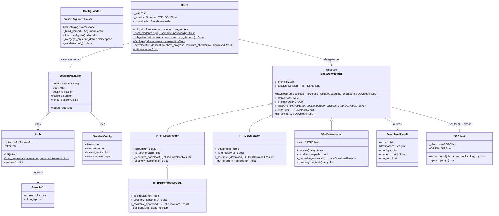
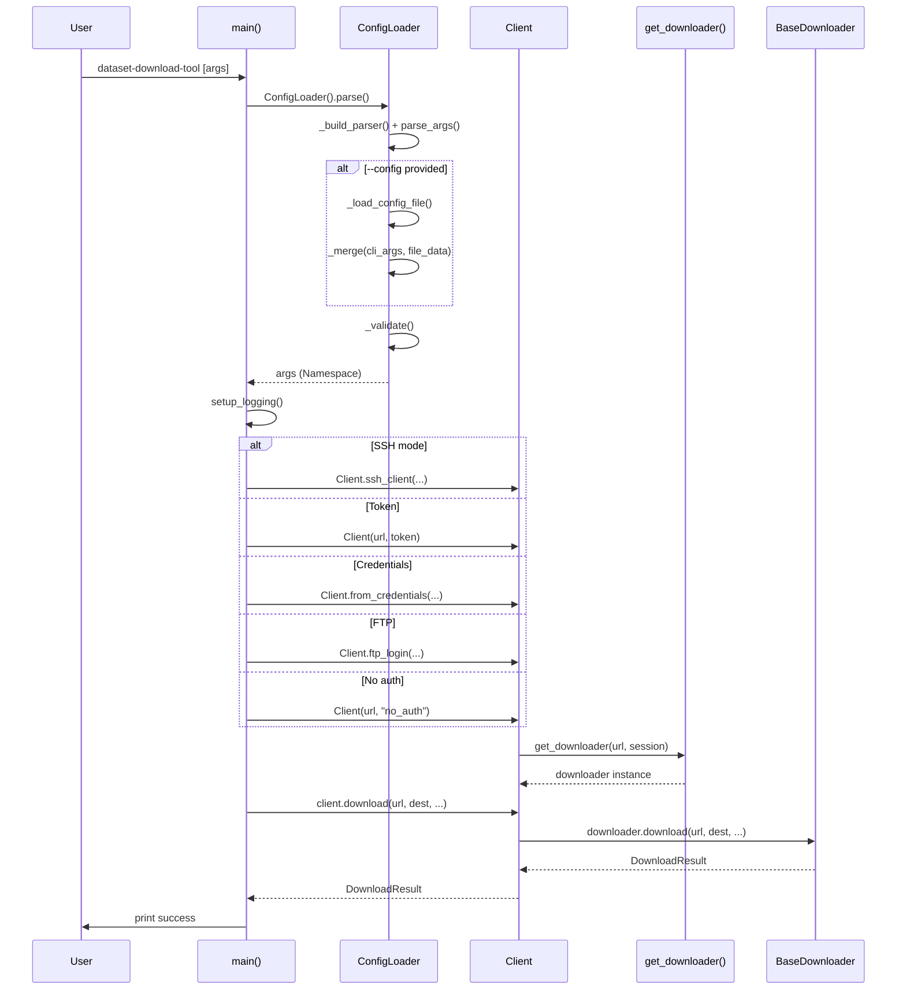
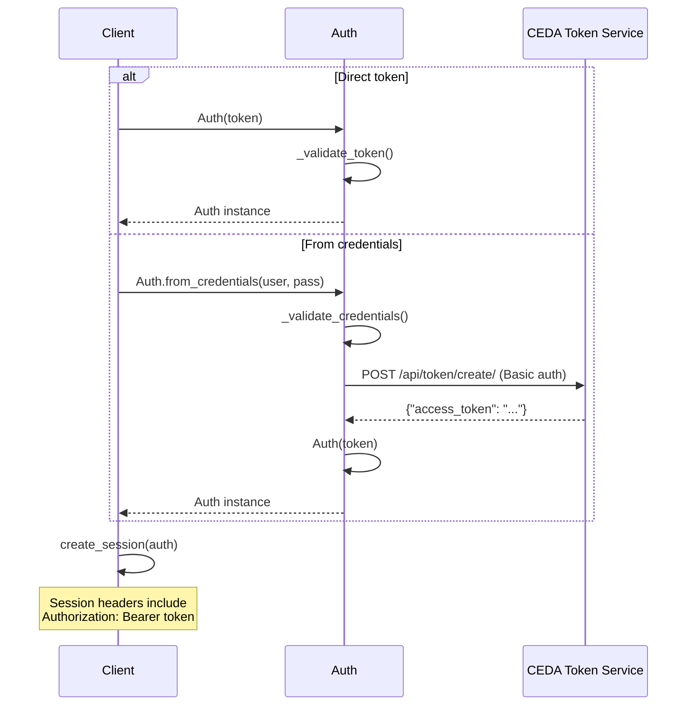
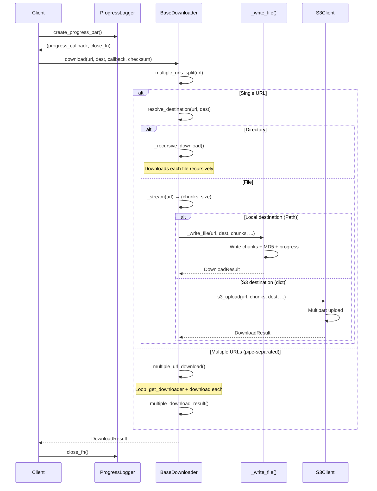

# Design

This document describes the detailed design of the Dataset Download Tool — the
classes that make up the implementation, the design patterns they use, and the
runtime interactions between them. For a higher-level view of the system, see
[Architecture](architecture.md).

## Class Diagram

The class diagram below shows the main classes in the tool and their
relationships. The `BaseDownloader` abstract class is at the heart of the
downloader layer — concrete downloaders (`HTTPDownloader`, `FTPDownloader`,
`SSHDownloader`, `HTTPDownloaderGWS`) implement the protocol-specific behaviour.

## Design Patterns

### Factory Pattern — `get_downloader()`

The `get_downloader()` function in `downloader/__init__.py` selects the appropriate downloader based on URL prefix:

| URL Pattern | Downloader |
|-------------|------------|
| Starts with `GWS_BASE_URL` | `HTTPDownloaderGWS` |
| `http://` or `https://` | `HTTPDownloader` |
| `ftp://` | `FTPDownloader` |
| Anything else (file paths) | `SSHDownloader` |

### Template Method — `BaseDownloader.download()`

`BaseDownloader` defines the download algorithm in `download()`. Subclasses provide the protocol-specific behaviour by implementing three abstract methods:

- `_stream(url)` — return an iterable of bytes and optional total size
- `_is_directory(url)` — check whether the URL points to a directory
- `_recursive_download(...)` — handle directory traversal

### Alternative Constructors — `Client`

`Client` uses class methods as alternative constructors for different authentication modes:

- `Client(url, token=...)` — direct token
- `Client.from_credentials(url, username, password)` — generate token from CEDA credentials
- `Client.ssh_client(url, hostname, username, key_filename)` — SSH key auth
- `Client.ftp_login(url, username, password)` — FTP login

## Sequence Diagrams

The following sequence diagrams show the runtime interactions for the main
use-cases: command-line execution, authentication, and the download process
itself.

### CLI Execution Flow

This diagram traces a full invocation of the CLI from argument parsing through
to the final download result.

### Authentication Flow

Authentication can happen in two ways — a pre-existing token can be passed
directly, or CEDA credentials can be exchanged for a token via the CEDA token
service.

### Download Flow

The download flow shows how the `BaseDownloader.download()` template method
orchestrates single-file, directory, and multi-URL downloads — and how
destinations can be either local paths or an S3 bucket.

