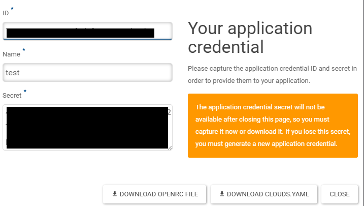

# Development Setup

## Prerequisites

- **Python** >= 3.12
- **uv** — Python package and project manager. [Install uv](https://docs.astral.sh/uv/getting-started/installation/) if you don't have it.
- **s3cmd** — for S3 bucket testing

## Clone the Repository

```bash
git clone https://github.com/dafnifacility/dataset-download-tool.git
cd dataset-download-tool
```

Add s3cmd to the virtual environment:

```bash
uv add s3cmd
```

## Environment Setup

Sync all dependencies (including optional extras) into a virtual environment:

```bash
uv sync --all-extras
```

To install a specific extra group:

```bash
uv sync --extra dev
uv sync --extra tests
uv sync --extra docs
```

## Running the CLI

Run the tool using `uv run` (ensures the correct environment):

```bash
uv run dataset-download-tool --help
```

Example download with debug logging:

```bash
uv run dataset-download-tool --no-auth \
  --url https://dap.ceda.ac.uk/badc/ARCHIVE_INFO/00FILES_ON_OBJECTSTORE.txt?download=1 \
  --dest ./data/ --debug
```

## Pre-commit Hooks

Install pre-commit hooks to run linting (Ruff) before each commit:

```bash
uv run pre-commit install
```

## S3 Setup (Optional)

Required only if testing S3 upload functionality.

### Option 1: MinIO (Local)

Run MinIO in Docker:

```bash
docker run -p 9000:9000 -p 9001:9001 \
  -e "MINIO_ROOT_USER=minioadmin" \
  -e "MINIO_ROOT_PASSWORD=minioadmin" \
  quay.io/minio/minio server /data --console-address ":9001"
```

Open `http://localhost:9001` and login with `minioadmin` / `minioadmin`.

Configure environment:

```bash
export ACCESS_KEY=minioadmin
export SECRET_KEY=minioadmin
```

Configure s3cmd:

```bash
uv run s3cmd --configure
```

Use these settings:

```
Access Key: minioadmin
Secret Key: minioadmin
Default Region: us-east-1
S3 Endpoint: localhost:9000
DNS-style bucket template: %(bucket)s.localhost:9000
Use HTTPS: False
```

### Option 2: STFC ECHO S3

For internal STFC users who have access to OpenStack, follow these steps to set up S3 for testing.

**Prerequisites:** Connected to STFC VPN with access to STFC OpenStack.

#### Application Credentials

To use the OpenStack CLI you need environment variables for connecting to STFC Cloud:

1. Sign in to [OpenStack](https://openstack.stfc.ac.uk/)
2. Go to **Identity > [Application Credentials](https://openstack.stfc.ac.uk/identity/application_credentials/)**
3. Click **+ CREATE APPLICATION CREDENTIAL**
4. Only the **Name** field is required — everything else can be left blank

   { width="50%" }

5. Click **DOWNLOAD OPENRC FILE** and save it to the machine you will run the tool from

   { width="50%" }

6. Source the downloaded file to set the environment variables:

   ```bash
   source app-cred-test-openrc.sh
   ```

#### OpenStack CLI

Install the Python package:

```bash
sudo apt update && sudo apt upgrade
sudo apt install python3-openstackclient
```

Verify the CLI detects your STFC Cloud settings:

```bash
openstack server list
```

#### Create EC2 Credentials

These credentials connect to S3 buckets on STFC Cloud:

```bash
openstack ec2 credentials create
```

Set them as environment variables:

```bash
export ACCESS_KEY=<access_key>
export SECRET_KEY=<secret_key>
```

#### Configure s3cmd

```bash
uv run s3cmd --configure
```

Use these settings:

```
Access Key: <access_key>
Secret Key: <secret_key>
Default Region: US
S3 Endpoint: s3.echo.stfc.ac.uk
DNS-style bucket+hostname:port template: %(bucket)s.s3.echo.stfc.ac.uk
Encryption password:
Path to GPG program: /usr/bin/gpg
Use HTTPS protocol: True
HTTP Proxy server name:
HTTP Proxy server port: 0
```

Verify with:

```bash
uv run s3cmd ls
```

Create a test bucket to use later:

```bash
s3cmd mb s3://ddttest
```

### Option 3: Azure Blob Storage

!!!note 
The tool supports Azure blob storage and we tested it using emulator provided by Microsoft Azure. See the [Azure setup guide](azure.md) for details.