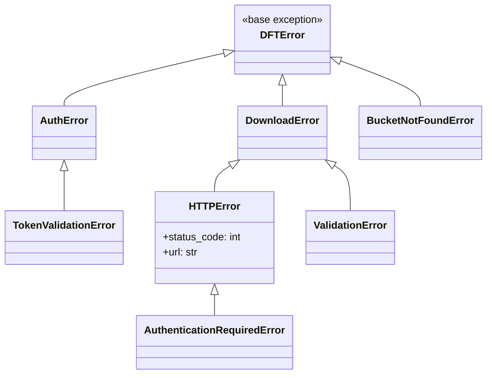

# Exceptions

All custom exceptions inherit from `DFTError`.

## Hierarchy

## Reference

::: dataset_download_tool.exceptions

## Summary

| Exception                  | Parent          | Raised When                                                         |
| -------------------------- | --------------- | ------------------------------------------------------------------- |
| `DFTError`                 | `Exception`     | Base for all project exceptions                                     |
| `AuthError`                | `DFTError`      | Authentication fails (invalid credentials, token service errors, storage access denied) |
| `TokenValidationError`     | `AuthError`     | Token is empty, wrong type, or invalid format                       |
| `DownloadError`            | `DFTError`      | Download operation fails (network error, server error)              |
| `HTTPError`                | `DownloadError` | HTTP request returns an error status code                           |
| `AuthenticationRequiredError` | `HTTPError`  | Server returns 401 — authentication required but not provided       |
| `ValidationError`          | `DownloadError` | Input validation fails (invalid URL, bad destination path or format) |
| `BucketNotFoundError`      | `DFTError`      | S3 bucket or Azure container does not exist                         |

## Where Exceptions Are Raised

| Exception                  | Source Locations                                                                                                                                                            |
| -------------------------- | --------------------------------------------------------------------------------------------------------------------------------------------------------------------------- |
| `AuthError`                | `transport/auth.py` (token generation), `transport/client.py` (SSH/FTP connection), `storage_selector/s3_upload.py` (S3 credential errors), `storage_selector/azure_upload.py` (Azure auth errors) |
| `TokenValidationError`     | `transport/auth.py` (token/credential validation)                                                                                                                           |
| `HTTPError`                | `downloader/services/*` (HTTP protocol errors)                                                                                                                              |
| `AuthenticationRequiredError` | `downloader/services/*` (HTTP 401 responses)                                                                                                                             |
| `DownloadError`            | `downloader/services/*` (protocol errors)                                                                                                                                   |
| `ValidationError`          | `transport/client.py` (URL validation), `downloader/base.py` (path errors), `storage_selector/selector_utils.py` (destination format), `cli/config_parser.py` (argument validation) |
| `BucketNotFoundError`      | `storage_selector/s3_upload.py` (missing S3 bucket), `storage_selector/azure_upload.py` (missing Azure container)                                                          |
