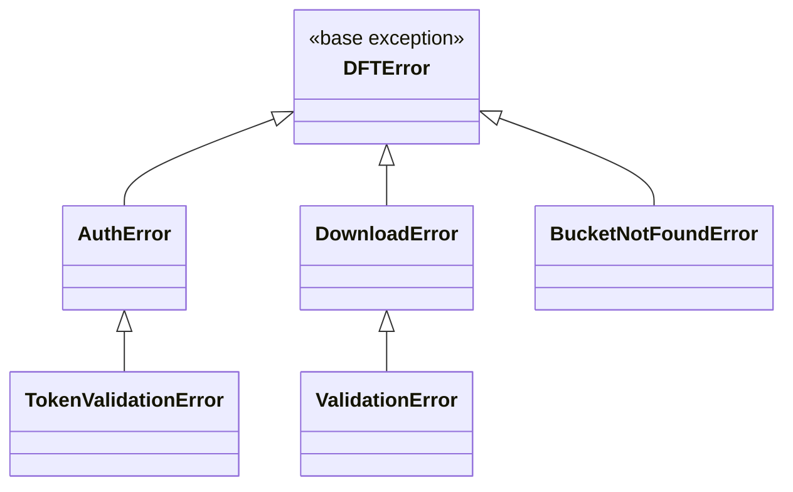

# Exceptions

All custom exceptions inherit from `DFTError`.

## Hierarchy

## Reference

::: dataset_download_tool.exceptions

## Summary

| Exception              | Parent          | Raised When                                                      |
| ---------------------- | --------------- | ---------------------------------------------------------------- |
| `DFTError`             | `Exception`     | Base for all project exceptions                                  |
| `AuthError`            | `DFTError`      | Authentication fails (invalid credentials, token service errors) |
| `TokenValidationError` | `AuthError`     | Token is empty, wrong type, or invalid format                    |
| `DownloadError`        | `DFTError`      | Download operation fails (network error, server error)           |
| `ValidationError`      | `DownloadError` | Input validation fails (invalid URL, bad destination path)       |
| `BucketNotFoundError`  | `DFTError`      | S3 bucket does not exist                                         |

## Where Exceptions Are Raised

| Exception              | Source Locations                                                                                                                                                     |
| ---------------------- | -------------------------------------------------------------------------------------------------------------------------------------------------------------------- |
| `AuthError`            | `transport/auth.py` (token generation), `transport/client.py` (SSH/FTP connection)                                                                                   |
| `TokenValidationError` | `transport/auth.py` (token/credential validation)                                                                                                                    |
| `DownloadError`        | `downloader/services/*` (protocol errors)                                                                                                                            |
| `ValidationError`      | `transport/client.py` (URL validation), `downloader/base.py` (path errors), `downloader/download_utils.py` (S3 format), `cli/config_parser.py` (argument validation) |
| `BucketNotFoundError`  | `downloader/s3_upload.py` (missing S3 bucket)                                                                                                                        |
