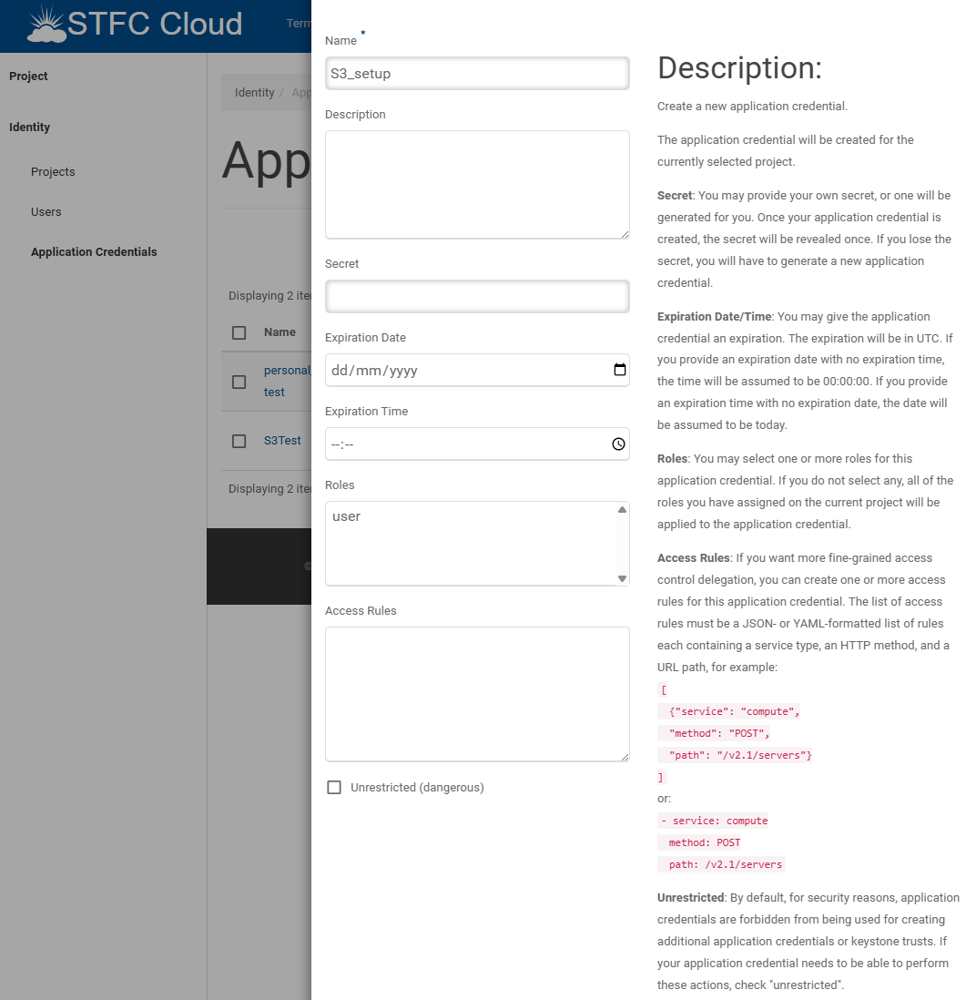

# 🚀 Setup STFC S3 Echo

For internal STFC who have access to openstack, they can setup S3 for testing purposes. 

## ✅ Prerequisites

- Connected to STFC VPN
- Access to STFC Openstack

## 🛠️ Setup

### 🔑 Application Credentials 

To use the Openstack CLI you have to set all the environment variables required for Openstack CLI to connect to STFC Cloud. 

These can be installed and setup by:

1. Sign in to [OpenStack](https://openstack.stfc.ac.uk/)
2. Go to Identity > [Application Credentials](https://openstack.stfc.ac.uk/identity/application_credentials/) in the menu on the left of the screen
3. Click [`+ CREATE APPLICATON CREDENTIAL`](https://openstack.stfc.ac.uk/identity/application_credentials/create/)
4. You will see a menu like below. Only thing which is important is the `Name` everything else can be left blank (It can be changed if you want a specific setup)



5. Click `DOWNLOAD OPENRC FILE` and save it to your machine you will run the tool from


6. You can run the downloaded file to set the ENV variables for OpenStack by tunning the follwing command
```bash
source app-cred-test-openrc.sh
```

### 💻 Openstack CLI

1. Install the python package:

```bash 
sudo apt update
sudo apt upgrade
sudo apt install python3-openstackclient
```

2. Test if the Openstack CLI has detected the STFC CLOUD setting from ENV:
```bash
openstack server list
```
Should see:
```bash
+--------------------------------------+------------------+--------+------------------------+--------------------------+---------+
| ID                                   | Name             | Status | Networks               | Image                    | Flavor  |
+--------------------------------------+------------------+--------+------------------------+--------------------------+---------+
| d00ed6c9-5d14-4f05-91db-b296c4e87a10 | Ubuntu-OVAL-Test | ACTIVE | Internal=172.16.102.46 | ubuntu-focal-20.04-nogui | l3.tiny |
+--------------------------------------+------------------+--------+------------------------+--------------------------+---------+
```

### 🗝️ Create EC2 credentials

These credentials are used to connect to S3 buckets on the STFC CLOUD.

1. Run the create credentials command:
```
openstack ec2 credentials create
```
```bash
user@stfc:~$ openstack ec2 credentials create
+------------+-------------------------------------------------------------------------------------------------------+
| Field      | Value                                                                                                 |
+------------+-------------------------------------------------------------------------------------------------------+
| access     | [ACCESS KEY]                                                                                          |
| links      | {'self': 'https://openstack.stfc.ac.uk:5000/v3/users/....7b469/credentials/OS-EC2/c786abc6b1....013'} |
| project_id | f86cf139e3044cf5a27                                                                                   |
| secret     | [SECRET_KEY]                                                                                          |
| trust_id   | None                                                                                                  |
| user_id    | [USER_ID]                                                                                             |
+------------+-------------------------------------------------------------------------------------------------------+
```

These can be set as ENV variables to access the S3 storage:
```bash
export ACCESS_KEY=[access_key]
export SECRET_KEY=[secret_key]
```