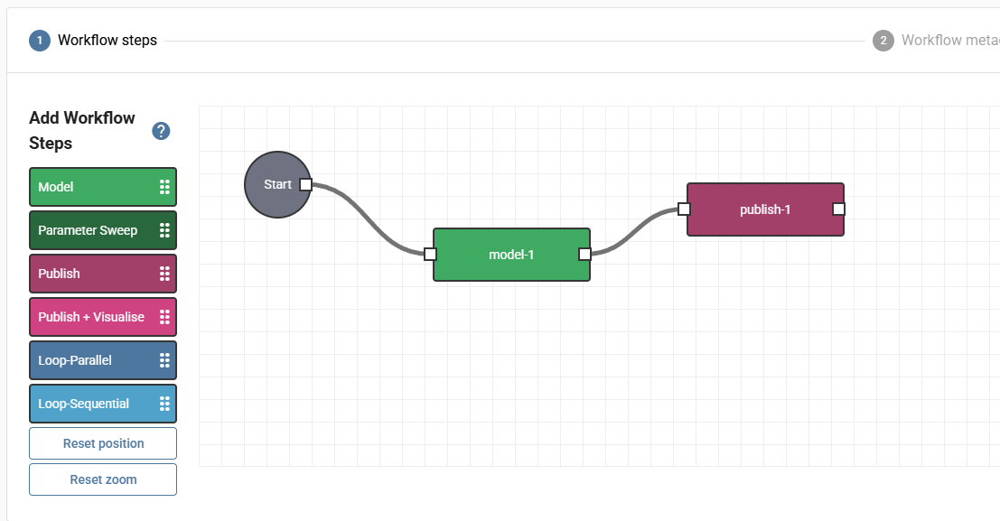

# DAFNI Integration

This guide covers using the DAFNI Data Bridge on the [DAFNI platform](https://docs.secure.dafni.rl.ac.uk/docs/How%20to/how-to-get-started). It enables models to download datasets from CEDA or JASMIN GWS as part of a DAFNI workflow.

## Config File Setup

On DAFNI, the tool is driven by a JSON config file uploaded as a DataSlot. Save it as `download_args.json`:

```json
{
  "no_auth": "",
  "url": "https://dap.ceda.ac.uk/path/to/file.nc",
  "checksum": ""
}
```

Supported authentication methods in the config:

- `no_auth` — for publicly accessible files
- `token` — CEDA access token
- `username` + `password` — CEDA credentials

!!! note "Boolean flags"
Set boolean flags to `""` to enable them (e.g., `"no_auth": ""`, `"checksum": ""`).

!!! warning "Do NOT use `--dest`"
On the DAFNI platform, do **not** set the `dest` flag in your config file. The output path is managed by the platform — overriding it will break output publishing.

### Username/Password Config Example

```json
{
  "username": "USERNAME",
  "password": "PASSWORD",
  "url": "https://dap.ceda.ac.uk/path/to/file.nc",
  "checksum": ""
}
```

!!! danger "Privacy"
If your config contains credentials, do **not** share the dataset with anyone. Only you have access to datasets you upload.

## Uploading the Config to DAFNI

1. Go to the **Data** section and click **Add Data**:

   { width="50%" }

2. Fill in all required fields (marked with `*`), tick **My data is not spatial** and **My data has no dates**. Other fields can be set as you see fit.

3. The dataset can be updated with new versions at any time.

## Model Definition

An example `model_definition.yaml` is provided in the repository. In the inputs dataslot, set the `Dataset Version ID` in the `default` value with the ID generated when uploading your config.

This ID only needs to be set initially when uploading your model. If you later update `download_args.json`, upload a new version of the dataset and select it in workflow parameters.

## Model Flow

The example sets up a single model step that downloads a dataset:

{ width="50%" }

- **model-1** — the download model step
- **publish-1** — output data publication

The `download_model.py` script sets up directories and logging, then runs the tool via subprocess:

```python
cmd = [
    "dataset-download-tool",
    "--config",
    config_path,
    "--dest",       # DO NOT CHANGE OUTPUT PATH ON DAFNI
    outputs_path,
    "--log-file",
    LOG_FILE,
]

result = subprocess.run(cmd, check=True, capture_output=True, text=True)
```

## Further Examples

See the [DAFNI example models repository](https://github.com/dafnifacility/dafni-example-models/tree/add-dataset-download-examples) for more complete examples.
