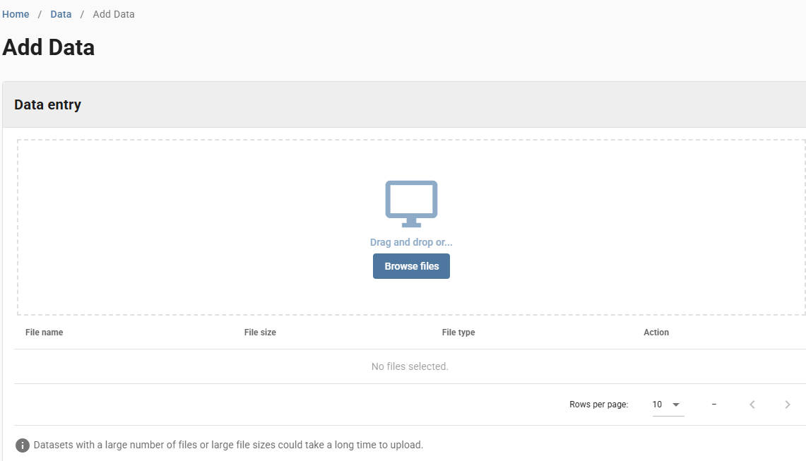

# DAFNI Data Bridge

This document goes over how to use the [DAFNI Data Bridge](https://github.com/dafnifacility/dataset-download-tool) on the DAFNI platform. The tool enables users to download datasets directly from CEDA archive or Jasmin GWS, and run further models on the downloaded data.

## Pre-requisites

This README should be used as an extention of the [DAFNI documentation](https://docs.secure.dafni.rl.ac.uk/docs/How%20to/how-to-get-started) and any questions should be answered in the main documentation.

>**TEMPORARY DEVELOPMENT NOTE** when building the model with `docker build --build-arg GITHUB_TOKEN=[INSERT TOKEN] -t download-tool:to-upload .` a token can be generated in [github developer settings ](https://github.com/settings/tokens) using classic token

### Config file

We will use a config file in order to input arguments and upload it to the dafni platform as a Dataslot. Each model has an inputs folder which has an example file of what config file should look like.

```JSON
    {
        "no_auth":"",
        "url":"https://dap.ceda.ac.uk/path/to/file.nc",
        "checksum":""
    }
```
This file should be saved as `download_args.json`. The possible auth methods: `token`, `username`+`password` or `no_auth`. 
> **NOTE: Any boolean args such as `no_auth` should be "" as this sets it to `True` otherwise it defaults to `False`**. 

As we are running on the DAFNI platform you should not use the `--dest` (destination) flag otherwise outputs may not be output correctly. 

`username`+`password` example:
```JSON
    {
        "username":"USERNAME",
        "password": "PASSWORD",
        "url":"https://dap.ceda.ac.uk/path/to/file.nc",
        "checksum":""
    }
```
#### Uploading to DAFNI

Go to the Data section and click `Add Data`:



Fill in all the boxes with `*` and ticking `My data is not spatial` and `My data has no dates`. Other fields can be anything and you can input values as you please. 

This dataset can be updated any time with new versions. So any value can be updated when running the workflow in parameters.

**PRIVACY NOTE: If credentails are uploaded DO NOT GIVE ACCESS TO DATASET TO ANYONE. Only you have access to Datasets that you upload**

### Model Definition

An example file is provided, `model_definition.yaml`. In the inputs dataslot add `Dataset Version ID` in the `default` value with ID generated. This ID only needs to be set initially and when uplaoding your model. If you then have to update the `download_args.json` file you can just update the version of the dataset by uploading a new file, then select it in parameters when running the workflow.

## Model Flow

In this example we setup a single model which downloads a dataset 


`model-1` is the model step and `publish-1` shows the output data.

The `../download_model.py` file first sets up the directories and sets up logging these are optional but useful for debugging potential errors.

```Python
...
#------------------ Run download command and handle any errors ------------------ #
cmd = [
    "dataset-download-tool",
    "--config",
    config_path,
    "--dest", # DO NOT CHANGE OUTPUT PATH WHEN RUNNING ON DAFNI, HERE OR IN CONFIG FILE
    outputs_path, 
    "--log-file",
    LOG_FILE,
]

logger.info("Starting download — command: %s", " ".join(cmd))
try:
    result = subprocess.run(
        cmd,
        check=True,
        capture_output=True,
        text=True,
    )
    logger.info("Download completed successfully.")
    if result.std...
```
Further model example: https://github.com/dafnifacility/dafni-example-models/tree/add-dataset-download-examples